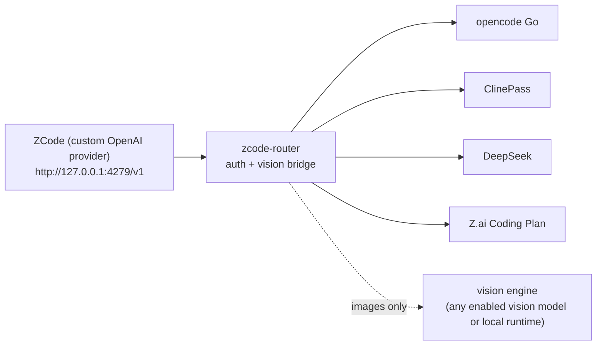

# zcode-router

Local, cross-platform model router for [ZCode](https://zcode.z.ai) (the Z.ai ADE / ZCode Agent).

It lets you point ZCode at **subscription providers** like **opencode Go** or **ClinePass**
(and plain APIs like DeepSeek or the Z.ai GLM Coding Plan) through one loopback endpoint —
and it adds the missing superpower: a **vision bridge**. Text-only models such as
DeepSeek V4 Flash can't see pasted screenshots; the router transparently sends each image
to a vision-capable model you choose, and hands the text-only model the extracted evidence
as text. One cheap subscription (`deepseek-v4-flash` for everything) plus one vision reader
= a multimodal coding agent.

Inspired by [codex-router](https://github.com/duolahypercho/codex-router), rebuilt as a
single zero-dependency Node.js CLI so it works the same on **Windows, macOS, and Linux** —
no Python, no LiteLLM, no WSL, no build step.

## Install

```sh
npm install -g zcode-router
zcode-router selftest   # full end-to-end check against a built-in mock provider — no API key needed
zcode-router setup      # pick providers, paste keys (hidden prompt)
zcode-router start      # keep running while you use ZCode
```

Then in ZCode: **Settings → Model Settings → Add Provider**, and paste what `setup` printed:

| Field | Value |
| --- | --- |
| Name | `zcode-router` |
| Base URL | `http://127.0.0.1:4279/v1` |
| API Key | the loopback key printed by `setup` / `doctor` / `start` |

Both protocol choices work — the router speaks **Anthropic Messages** (`/v1/messages`,
ZCode's default "Anthropic" provider template) and **OpenAI Chat Completions**
(`/v1/chat/completions`), including streaming and tool calls. ZCode fetches the model list
from the router automatically; if the list does not load, `zcode-router start` and
`zcode-router models` print the exact model IDs to paste in manually
(e.g. `opencode-go/deepseek-v4-flash`).

Requires Node.js ≥ 22. No other dependency. The router binds to `127.0.0.1` only.

## Why not codex-router?

codex-router targets the Codex CLI/desktop app and leans on a Python/LiteLLM stack that is
fragile on Windows. zcode-router targets **ZCode**, is **one npm package with zero runtime
dependencies**, and can be verified end-to-end **without any provider account** thanks to the
built-in mock (`zcode-router selftest`).

## Providers

| Provider ID | Endpoint | Key |
| --- | --- | --- |
| `opencode-go` | `https://opencode.ai/zen/go/v1` | `OPENCODE_GO_API_KEY` / `OPENCODE_API_KEY` env, or stored |
| `clinepass` | `https://api.cline.bot/api/v1` | `CLINEPASS_API_KEY` env, or stored |
| `deepseek` | `https://api.deepseek.com/v1` | `DEEPSEEK_API_KEY` env, or stored |
| `zai-coding` | `https://api.z.ai/api/coding/paas/v4` | `ZAI_API_KEY` env, or stored |

`opencode-go` covers the full Go catalog: the Chat Completions models (DeepSeek V4, Kimi,
GLM, MiMo, Grok, Hy3) and the MiniMax/Qwen models, which opencode serves only over its
Anthropic Messages endpoint — the router translates both directions, so they work with
either zCode protocol choice and with the vision bridge. (Go's `gpt-5.6-luna` is served
only over the OpenAI Responses API, which the router does not implement.)

Environment variables win over stored keys. Keys are stored in
`~/.zcode-router/config.json` with mode `0600` (POSIX) or a current-user-only ACL (Windows),
entered through a hidden terminal prompt.

Add anything else OpenAI-compatible (a corporate gateway, another subscription, …):

```sh
zcode-router providers add-custom mycorp --base-url https://llm.corp.example/v1 --models qwen3.8-max,glm-5.2 --vision glm-5.2
zcode-router providers key mycorp set
```

## The vision bridge

On by default. When a request for a **text-only** model contains an image, the router:

1. sends the image to the configured vision engine (auto-picks the cheapest vision-capable
   model from your enabled providers, e.g. `opencode-go/grok-4.5`),
2. replaces the image with fenced, clearly-labelled evidence text: summary, verbatim
   transcript, layout, data values, and an explicit "illegible" list,
3. caches reads by image hash for an hour — ZCode replays history every turn, so a 10-turn
   conversation about one screenshot costs **one** vision call.

If no engine is available, nothing changes: the provider refuses the paste exactly as it
would without the router. If the engine errors, the model is told the image could not be
read instead of being left to invent its contents.

The catalog advertises image input on every routed model while a vision engine is
configured. zCode still often omits the screenshot from the HTTP request and injects a
local path under `~/.zcode/cli/image-cache/` plus a "model does not support image input"
reminder — the router reads that cache file and bridges it anyway. `start` also patches
`~/.zcode/v2/config.json` so zCode's own gate allows attachments (`zcode-router zcode-patch`
to do it by hand). Fully quit zCode after a patch.

If a paste still falls through to OCR, restart with verbose logs and share them:

```sh
zcode-router start --verbose
```

```sh
zcode-router vision-bridge                      # status
zcode-router vision-bridge engine opencode-go/grok-4.5   # pin an engine
zcode-router vision-bridge engine auto          # cheapest vision-capable enabled model
zcode-router vision-bridge off                  # never spend vision quota on pastes
```

### Free, private, offline: a local vision model

Point the engine at any local OpenAI-compatible server — LM Studio, Ollama, llama.cpp —
and screenshots never leave your machine:

```sh
zcode-router vision-bridge engine local --base-url http://127.0.0.1:1234/v1 --model qwen2.5vl:3b
```

(That's LM Studio's default address; Ollama is `http://127.0.0.1:11434/v1`.)

Is a model vision-capable? The registry is conservative; override per model:

```sh
zcode-router models vision opencode-go/glm-5.2 on
```

## Everyday commands

```sh
zcode-router doctor            # verify everything; prints the zCode settings block
zcode-router doctor --probe    # also ping each provider's free /models endpoint
zcode-router providers         # what is enabled, where keys come from
zcode-router models            # the catalog ZCode will see
zcode-router update            # npm self-update (auto-checked once a day on `start`)
```

The router runs in the foreground — keep the terminal open, or background it your platform's
way (Task Scheduler / `pm2` / `systemd --user`). It is a single process; there is no service
installer to go wrong on Windows.

## How it works



The server speaks the OpenAI Chat Completions API (`GET /v1/models`,
`POST /v1/chat/completions`) and the Anthropic Messages API (`POST /v1/messages`,
`POST /v1/messages/count_tokens`), streaming SSE included; Anthropic requests are
translated to the canonical OpenAI shape, so every upstream provider and the vision bridge
work identically for both protocols. For OpenAI-protocol clients, routing is a faithful
byte-level pass-through: tool calls, streaming, and usage payloads are forwarded untouched —
only the `model` field is rewritten to the upstream id, the upstream key is injected, and
the vision bridge rewrites image parts when the target model can't see.

ZCode keeps owning the agent loop, tools, permissions, and workspace. The router only does
inference routing.

## Security

See [SECURITY.md](SECURITY.md). Short version: loopback-only listener, random local bearer
key (timing-safe comparison), keys stored user-only, upstream base URLs must be HTTPS
(loopback exempt for local models), request bodies capped (64 MiB by default,
`ZCODE_ROUTER_MAX_BODY_BYTES` to change), zero runtime dependencies, npm releases published
with provenance from GitHub Actions.

## Updating & releases

Releases are tag-driven: CI tests on Ubuntu/Windows/macOS × Node 22/24, then
`npm publish --provenance` and a GitHub release. To cut one:

```sh
npm version patch   # bumps, commits, tags vX.Y.Z
git push --follow-tags
```

Requires the `NPM_TOKEN` repo secret (or switch to npm trusted publishing — the workflow
already requests `id-token: write`).

## License

MIT. Independent community project, not affiliated with Z.ai, opencode, Cline, or DeepSeek.
