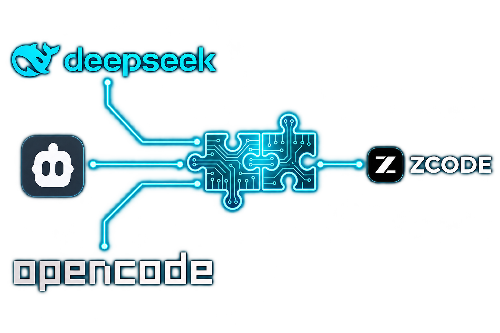

# zcode-router 


<p align="center">
  
</p>

Local model router for [ZCode](https://zcode.z.ai) (the Z.ai ADE / ZCode Agent).

Point ZCode at **subscription providers** — **opencode Go**, **ClinePass**, **Qwen plan**, **Command Code**, **MiniMax Token Plan**, **Ollama Cloud** — or plain APIs like DeepSeek, Kimi, Grok, and Anthropic — through one loopback endpoint. ZCode already ships **Z.ai GLM Coding Plan**, so this router does not duplicate it. And it adds the missing
superpower: a **vision bridge**. Text-only models such as DeepSeek V4 Flash can't see
pasted screenshots; the router transparently sends each image to a vision-capable
model you choose and hands the text-only model the extracted evidence as text.
One cheap subscription for everything plus one vision reader = a multimodal coding agent.

Install once, forget it — a background runner (Docker or a scheduled service) keeps it
alive, auto-restarts it, and survives reboots.

## Install

Requires Node.js ≥ 22 — nothing else to install. The router only listens on `127.0.0.1`.

### Recommended: `npx zcode-router setup` + Docker

```sh
npx zcode-router selftest   # end-to-end check with a built-in mock provider — no API key needed
npx zcode-router setup      # guided: pick providers, paste keys, then install
```

`setup` walks you through the settings (which providers, their API keys), then asks
how to keep the router running — ZCode needs it as a provider the whole time you work.

The provider list is a toggle, not a one-shot prompt: type numbers (comma-separated is
fine) to check `[x]` as many APIs as you want. Empty Enter is what continues to keys
and then the Docker/service/manual choice. `a` selects all, `n` clears the set.
Pick **Docker**:

1. **Docker (recommended)** — copies the router into a `node:22-alpine` image with
   `restart: unless-stopped`, published on `127.0.0.1:4279`. The image is
   self-contained, so it keeps working even after the temporary npx cache is cleaned.
   Stop with `npx zcode-router docker down`; after an update, rebuild with
   `npx zcode-router docker`.
2. **Native service** — Windows Task Scheduler + hidden `.vbs` (ONLOGON), Linux
   `systemd --user`, macOS launchd. `setup` first copies the router into
   `~/.zcode-router/local`, so the service is independent of the npx cache too.
   Stop with `npx zcode-router service stop`.
3. **Manual** — not offered under `npx`: npx downloads the package into a temporary
   cache that gets cleaned up, so `zcode-router start` would silently stop working.
   Manual mode needs a permanent install — see below.

### Optional: permanent install (`npm install -g`)

Prefer a `zcode-router` command that is always there? Install it globally and run it
yourself:

```sh
npm install -g zcode-router
zcode-router setup            # the same guided flow — "Manual" is now available too
zcode-router start            # run it in a terminal whenever you work with ZCode
zcode-router service install  # or install it as a scheduled task / service
                              # (Task Scheduler, systemd, launchd — runs from ~/.zcode-router/local)
```

With the global install, `setup` offers all three options, including **Manual**
(`zcode-router start` in a terminal) and the **native service**, both backed by your
permanent copy of the package.

## Connect ZCode

`setup`, `start`, `zcode-patch`, and `doctor --fix` write a `zcode-router` provider into `~/.zcode/v2/config.json` when one is missing (loopback URL + the local key only). If zCode is not installed yet, paste what `setup` printed:

| Field | Value |
| --- | --- |
| Name | `zcode-router` |
| Base URL | `http://127.0.0.1:4279/v1` |
| API Key | the loopback key printed by `setup` / `doctor` / `start` |

Both protocol choices work — the router speaks **Anthropic Messages** (`/v1/messages`,
ZCode's default "Anthropic" provider template) and **OpenAI Chat Completions**
(`/v1/chat/completions`), including streaming and tool calls. ZCode fetches the model
list from the router automatically; if the list does not load, `zcode-router models`
prints the exact model IDs to paste in manually (e.g. `opencode-go/deepseek-v4-flash`).

## Providers

### Subscriptions

| Provider ID | Endpoint | Key |
| --- | --- | --- |
| `opencode-go` | `https://opencode.ai/zen/go/v1` | `OPENCODE_GO_API_KEY` / `OPENCODE_API_KEY` |
| `clinepass` | `https://api.cline.bot/api/v1` | `CLINEPASS_API_KEY` / `CLINE_API_KEY` |
| `qwen-plan` | Alibaba Model Studio token-plan (Singapore). Override with `QWEN_PLAN_BASE_URL` | `QWEN_PLAN_API_KEY` / `DASHSCOPE_API_KEY` |
| `commandcode` | `https://api.commandcode.ai/provider/v1` | `COMMAND_CODE_API_KEY` / `COMMANDCODE_API_KEY` |
| `minimax-token-plan` | `https://api.minimax.io/v1` | `MINIMAX_API_KEY` |
| `ollama-cloud` | `https://ollama.com/v1` | `OLLAMA_API_KEY` |

### Vendor APIs

| Provider ID | Endpoint | Key |
| --- | --- | --- |
| `deepseek` | `https://api.deepseek.com/v1` | `DEEPSEEK_API_KEY` |
| `kimi-api` | `https://api.moonshot.ai/v1` | `KIMI_API_KEY` / `MOONSHOT_API_KEY` |
| `kimi-api-cn` | `https://api.moonshot.cn/v1` | `KIMI_API_CN_KEY` |
| `grok-api` | `https://api.x.ai/v1` | `XAI_API_KEY` / `GROK_API_KEY` |
| `anthropic-api` | `https://api.anthropic.com/v1` (Messages) | `ANTHROPIC_API_KEY` |
| `gemini-api` | Gemini OpenAI-compat endpoint | `GEMINI_API_KEY` / `GOOGLE_API_KEY` |

### Catalog-only

These ship no preset model list (catalogs change too often). Enable, store a key, then `zcode-router models refresh` (or type `provider/<id>` in ZCode / `models add`):

`opencode-zen`, `groq`, `openrouter`, `together`, `fireworks`, `cerebras`, `mistral`, `nvidia-nim`, `siliconflow`, `huggingface`, `chutes`.

`opencode-go` covers the full Go catalog: the Chat Completions models (DeepSeek V4,
Kimi, GLM, MiMo, Grok, Hy3) and the MiniMax/Qwen models, which opencode serves only
over its Anthropic Messages endpoint — the router translates both directions, so they
work with either zCode protocol choice and with the vision bridge. `opencode-zen` shares
the same stored key and points at the pay-per-use Zen endpoint.

ClinePass upstream ids are rewritten to `cline-pass/…` automatically. Command Code
keeps short catalog ids (`commandcode/glm-5.2`) and sends the vendor path upstream
(`zai-org/GLM-5.2`). Claude models on Command Code and Anthropic use the Messages
protocol.

OAuth-only surfaces from Codex Router (Kimi Code CLI, Grok CLI) and Responses-only
APIs (Meta, GitHub Copilot, opencode `gpt-5.6-luna`) are not in this registry: this
router speaks Chat Completions and Anthropic Messages.

The curated list is a starting point, not a gate: any `provider/model` on an enabled,
keyed provider routes through — so when an upstream ships a new model, just type its
ID in zCode (e.g. `opencode-go/new-model`) and the router forwards it. To also make it
appear in the model list and pin its capabilities:

```sh
zcode-router models add opencode-go/new-model --vision --protocol messages
zcode-router models remove opencode-go/new-model
zcode-router models refresh groq
zcode-router models vision groq/llama-3.3-70b on
```

Environment variables win over stored keys. Keys entered during `setup` are stored in
`~/.zcode-router/config.json` and never leave your machine (see Security).

Add anything else OpenAI-compatible (a corporate gateway, another subscription, …):

```sh
zcode-router providers add-custom mycorp --base-url https://llm.corp.example/v1 --models qwen3.8-max,glm-5.2 --vision glm-5.2
zcode-router providers key mycorp set
```

## How it works: the vision bridge

On by default. When a request for a **text-only** model contains an image, the router:

1. sends the image to the configured vision engine — `opencode-go/minimax-m3` by
   default (cheap and very good; pin any other model with
   `zcode-router vision-bridge engine <provider/model>`, or `auto` to pick the
   cheapest vision-capable model from your enabled providers),
2. replaces the image with fenced, clearly-labelled evidence text: summary, verbatim
   transcript, layout, data values, and an explicit "illegible" list,
3. caches reads by image hash for an hour — ZCode replays history every turn, so a
   10-turn conversation about one screenshot costs **one** vision call.

The routing itself is a faithful pass-through: tool calls, streaming, and usage
payloads are forwarded untouched — only the `model` field is rewritten to the upstream
id and the upstream key injected. ZCode keeps owning the agent loop, tools,
permissions, and workspace; the router only does inference routing.

If no vision engine is available, nothing changes: the provider refuses the paste
exactly as it would without the router. If the engine errors, the model is told the
image could not be read instead of being left to invent its contents.

The catalog advertises image input on every routed model while a vision engine is
configured, and `setup`/`start` patch `~/.zcode/v2/config.json` so zCode's own gate
allows attachments. `setup` also asks how screenshots should work (`auto`, pin a vision
model, a local LM Studio/Ollama engine, or `off`). Non-image attachments (PDFs, `file`
parts in zCode's cache) are turned into fenced text the same way. After a failed
upstream call, `zcode-router doctor last` prints the last error.

### Free, private, offline: a local vision model

Point the engine at any local OpenAI-compatible server — LM Studio, Ollama, llama.cpp —
and screenshots never leave your machine:

```sh
zcode-router vision-bridge engine local --base-url http://127.0.0.1:1234/v1 --model qwen2.5vl:3b
```

(That's LM Studio's default address; Ollama is `http://127.0.0.1:11434/v1`.)
Other handy tweaks: `zcode-router vision-bridge off` to never spend vision quota on
pastes, or `zcode-router models vision <provider/model> on|off` to override whether a
model is treated as vision-capable.

## Security

Built to run on your own machine and face only ZCode on loopback:

- **Loopback only.** The router binds `127.0.0.1` exclusively. Docker publishes only
  `127.0.0.1:4279` on the host; inside the container it listens on `0.0.0.0` so the
  port mapping works, but nothing off-machine can reach it.
- **Authenticated, even locally.** Every request must present the random 32-char
  bearer key printed by `setup`/`doctor`/`start`, compared in constant time. The key
  only ever travels between ZCode and the router on loopback — don't share it.
- **Your upstream keys stay yours.** Stored in `~/.zcode-router/config.json` with mode
  `0600` (POSIX) or a current-user-only ACL (Windows), entered through a hidden
  terminal prompt. The router injects them into upstream calls; they never appear in
  the ZCode-facing API.
- **No arbitrary targets.** Upstream base URLs must be HTTPS (loopback exempt for
  local vision models), and the vision bridge refuses to read local image files
  outside zCode's own image cache.
- **Request bodies capped** at 64 MiB by default (`ZCODE_ROUTER_MAX_BODY_BYTES` to
  change).
- **Minimal supply chain.** Zero runtime dependencies — the package ships only the
  CLI and its own source. Releases are published to npm with provenance from GitHub
  Actions.

## License

MIT. Independent community project, not affiliated with Z.ai, opencode, Cline, or DeepSeek.

## Disclaimer

Special thanks for https://github.com/duolahypercho/codex-router/ . That is fork + rework for zCode.
